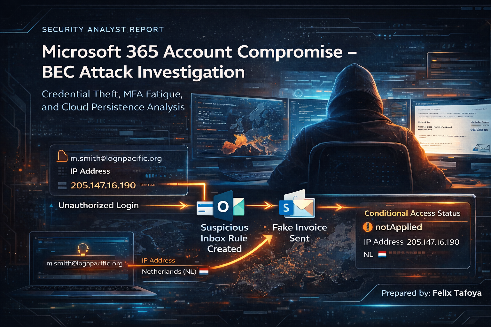

# 🛡️ Threat Hunt Report – Business Email Compromise (BEC)

---

## 📌 Executive Summary

On February 25, 2026, a Business Email Compromise (BEC) attack was identified within a Microsoft 365 environment. The attacker leveraged credentials obtained via infostealer malware and successfully authenticated using MFA fatigue techniques.

Following access, the attacker established persistence through malicious inbox rules, accessed cloud storage systems, and executed a fraudulent email attack targeting financial personnel.

---

## 🎯 Hunt Objectives

- Identify attacker entry point  
- Track attacker activity across cloud services  
- Detect persistence mechanisms  
- Map behavior to MITRE ATT&CK  
- Identify detection gaps  

---

## 🧭 Scope & Environment

- **Environment:** Microsoft 365 / Azure AD  
- **Data Sources:** SigninLogs, CloudAppEvents, EmailEvents  
- **Timeframe:** 2026-02-25 21:59 → 22:12 UTC  

---

## ⏱️ Attack Timeline

| Time (UTC) | Event |
|-----------|------|
| 21:59 | Initial attacker login from 205.147.16.190 |
| 22:00 | MFA fatigue attempts begin |
| 22:02 | Successful authentication |
| 22:02 | Malicious inbox rules created |
| 22:07 | OneDrive accessed |
| 22:09 | SharePoint accessed |
| 22:12 | BEC email sent |

---

## 🧠 Hunt Overview

1. Credentials stolen via infostealer malware  
2. Successful login from suspicious IP  
3. MFA fatigue used to gain access  
4. Inbox rules created for persistence  
5. OneDrive accessed  
6. SharePoint accessed  
7. BEC email sent  

---

## 🧬 MITRE ATT&CK Summary

| Technique | MITRE ID |
|----------|---------|
| Valid Accounts | T1078 |
| MFA Fatigue | T1621 |
| Account Manipulation | T1098 |
| Email Rule Evasion | T1564.008 |

---

## 🔍 Flag Analysis

---

🚩 Flag 1 – Initial Access (Infostealer)

### 📌 Finding
Multiple successful logins observed from attacker IP leading up to confirmed initial access at 21:59 UTC.

| Field | Value |
|------|------|
| Time | 2026-02-25 21:59 UTC |
| IP | 205.147.16.190 |

### 🧪 KQL Query
SigninLogs  
| where IPAddress == "205.147.16.190"  
| where ResultType == 0  

### 
*Note: Log timestamps are displayed in local time and correspond to 21:59 UTC initial access.*

---

🚩 Flag 2 – MFA Fatigue

### 📌 Finding
Repeated sign-in attempts observed within a short time window, including failed and successful authentication events, consistent with MFA fatigue attack behavior.

| Field | Value |
|------|------|
| Time | 2026-02-25 22:00 – 22:02 UTC |

### 🧪 KQL Query
SigninLogs  
| where IPAddress == "205.147.16.190"  

### 
*Figure 2: Clustered sign-in attempts including failures and eventual success, consistent with MFA fatigue (T1621).*

---

🚩 Flag 3 – Inbox Rule Persistence

### 📌 Finding
Malicious inbox rules were created immediately following successful authentication, indicating persistence and potential email manipulation. 

The inbox rule forwards emails to an external address (insights@duck.com), indicating potential data exfiltration and ongoing surveillance of victim communications.

This behavior is consistent with Business Email Compromise (BEC) tactics targeting financial transactions.

| Field | Value |
|------|------|
| Time | 2026-02-25 22:02 UTC |
| Forward | insights@duck.com |

### 🧪 KQL Query
CloudAppEvents  
| where ActionType == "New-InboxRule"  

### 
*Figure 3: Inbox rule creation events showing attacker-established persistence following account compromise.*

### 🔍 Extracted Rule Details
- Forwarding Address: insights@duck.com
- Keywords: invoice, payment, wire, transfer
- Additional Filters: suspicious, phishing, compromised
- MITRE: T1098 (Account Manipulation)

---

🚩 Flag 4 – Cloud Data Access

### 📌 Finding
Attacker accessed SharePoint Online following persistence, indicating post-compromise data exploration and potential exfiltration activity.

Multiple page view events observed, indicating active browsing of SharePoint resources.

MITRE: T1530 (Data from Cloud Storage)

| Field | Value |
|------|------|
| Time | 2026-02-25 22:07 UTC |

### 🧪 KQL Query
CloudAppEvents  
| where ActionType == "FileAccessed"  

### 

*Figure 4: SharePoint activity showing attacker access to cloud-hosted data following account compromise.*

---

🚩 Flag 5 – SharePoint Access

### 📌 Finding
Attacker accessed SharePoint Online resources following successful authentication and persistence, confirming interaction with cloud-hosted data. Observed page view activity indicates active browsing of content, increasing the likelihood of data reconnaissance or potential exfiltration.

Activity originated from the same attacker IP (205.147.16.190), reinforcing correlation with earlier compromise events.

MITRE: T1530 (Data from Cloud Storage)

| Field | Value |
|------|------|
| Time | 2026-02-25 22:07 UTC |

### 
Figure 5: SharePoint activity showing attacker interaction with cloud-hosted data.

---

🚩 Flag 6 – BEC Email Sent

### 📌 Finding
Compromised account m.smith@lognpacific.org was used to send an invoice-themed email from attacker IP 205.147.16.190, confirming active Business Email Compromise (BEC) activity and a likely attempt to redirect legitimate financial transactions to attacker-controlled accounts.

The subject line referencing updated banking details is consistent with common BEC tactics used to redirect legitimate payments.

MITRE: T1566 (Phishing)

This activity represents the execution phase of the attack, where the threat actor attempts to monetize access through social engineering.

This confirms the transition from initial compromise to impact, where the attacker leverages access for financial gain.

| Field | Value |
|------|------|
| Time | 2026-02-25 22:06 UTC |
| Sender | m.smith@lognpacific.org |
| Recipient | j.reynolds@lognpacific.org |
| Subject | RE: Invoice #INV-2026-0892 - Updated Banking Details |
| IP | 205.147.16.190 |

### 
Figure 6: EmailEvents evidence showing invoice-themed email sent from the compromised account, indicative of BEC-related financial fraud tactics.

---

🚩 Flag 7 – Session Correlation

### 📌 Finding
Multiple authentication and application access events were observed from the same IP address (205.147.16.190) and location (Netherlands), confirming a continuous attacker session following account compromise. Activity spans Outlook Web, SharePoint Online, and Office services, indicating coordinated attacker activity leveraging the compromised account across multiple cloud applications.

The sequence of failed and successful login attempts followed by access to multiple services suggests the attacker established and maintained persistent access during a single session.

MITRE: T1078 (Valid Accounts)

This activity demonstrates lateral movement across cloud services using a single authenticated session.

| Field | Value |
|------|------|
| IP Address | 205.147.16.190 |
| Location | Netherlands (NL) |
| Applications | Outlook Web, SharePoint Online, OfficeHome |
| Result | Successful authentication followed by multi-service access |

### 🧪 KQL Query
SigninLogs    

### 
Figure 7: Sign-in and application activity showing continuous attacker session across multiple Microsoft 365 services from a single IP address.

---

🚩 Flag 8 – Conditional Access Failure

### 📌 Finding
Conditional Access policies were not applied during attacker sign-in activity, allowing unauthorized access to proceed without restriction.

All observed authentication events from attacker IP 205.147.16.190 (Netherlands) show ConditionalAccessStatus = notApplied, indicating that no effective Conditional Access controls were enforced during the compromise window.

Despite multiple login attempts and successful authentications, the attacker was able to access Outlook Web, SharePoint Online, and Office services without policy-based interruption.

This confirms a critical gap in identity protection controls, enabling the attacker to maintain persistent access across cloud services.

### 🧠 MITRE ATT&CK  
T1078 – Valid Accounts

| Field                     | Value                                 |
| ------------------------- | ------------------------------------- |
| Time Window               | 2026-02-25 21:50–22:30 UTC            |
| IP Address                | 205.147.16.190                        |
| Location                  | Netherlands (NL)                      |
| Conditional Access Status | notApplied                            |
| Result                    | Successful access without enforcement |
| Applications | Outlook Web, SharePoint Online, OfficeHome |

### 🧪 KQL Query
SigninLogs  
| project ConditionalAccessStatus  

### 
Figure 8: Sign-in logs showing Conditional Access policies were not applied during attacker activity, allowing uninterrupted access from a malicious IP.

---

## 🚨 Detection Gaps & Recommendations

### Gaps
• Conditional Access policies were not enforced (status: notApplied)
• Lack of MFA fatigue detection allowed attacker approval attempts
• No alerting on suspicious inbox rule creation (New-InboxRule)  

### Recommendations
• Enforce Conditional Access policies (block legacy auth, require MFA for all cloud apps, restrict foreign logins)
• Enable MFA number matching and user reporting to prevent fatigue attacks
• Configure alerts for inbox rule creation and external forwarding
• Implement sign-in risk policies for impossible travel and anomalous IPs  

---

## 🧠 Key Takeaways

- MFA fatigue is a common and effective attack technique  
- Conditional Access is critical for identity protection  
- Inbox rules are frequently used for persistence in BEC attacks  
- Cloud services are often targeted after initial compromise

---

### 🧭 Attack Timeline

• 21:54 – Initial login attempts from Netherlands (NL)  
• 21:59 – Successful authentication using valid credentials (T1078) 
• 22:02 – Malicious inbox rule created (persistence established)  
• 22:05–22:12 – SharePoint / OneDrive access (data exploration)  
• 22:06 – BEC email sent (financial fraud attempt)  
• 22:09+ – Continued access across multiple Microsoft 365 services  

---

## 🧾 Final Assessment

This incident represents a full identity-based compromise, where the attacker leveraged valid credentials and MFA fatigue to gain access, established persistence via inbox rules, and conducted post-compromise activity across cloud services, ultimately attempting financial fraud through BEC techniques.

---

### 📝 Analyst Notes

• Investigation conducted using Microsoft Sentinel (KQL queries across SigninLogs, CloudAppEvents, and EmailEvents)  
• Correlated authentication, email, and cloud activity to reconstruct attacker timeline  
• Applied MITRE ATT&CK mapping to align observed behavior with known adversary techniques  
